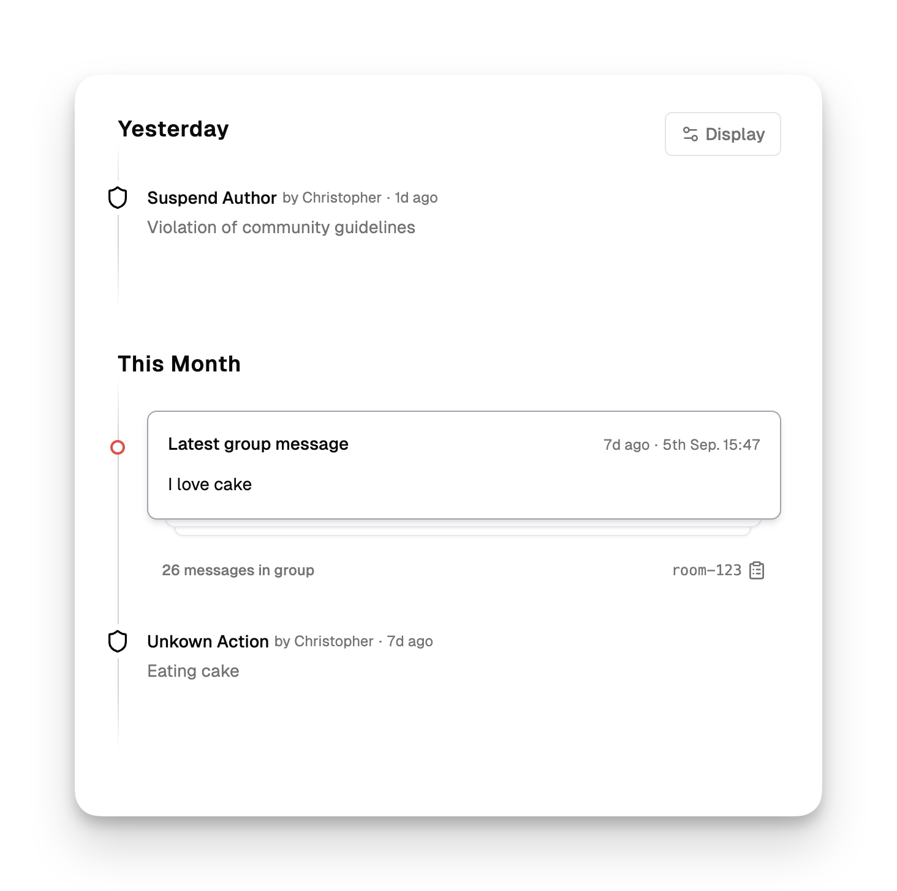

Moderation actions provide direct moderation controls for managing problematic users in your community.

Common scenarios for moderation actions:

- **Block persistent violators** identified through [trust levels](/users/trust-levels) or [fraud detection](/users/fraud-detection)
- **Remove spam accounts** posting promotional content repeatedly
- **Suspend users** to send clear signals about acceptable behavior

Actions can be executed manually from the [user dashboard](https://moderationapi.com/app/users) or programmatically via the [Author API](/api-reference/author). They complement content moderation by addressing the user behind the content, helping you stop persistent abuse and enforce community standards.

## Built-in actions

The system provides three essential moderation actions for comprehensive account management:

<AccordionGroup>
<Accordion title="Block (Permanent Ban)" icon="ban">
Permanently prevents a user from submitting content for moderation.

**When to use:**

- Spam accounts with no legitimate content
- Users repeatedly violating major community guidelines
- Accounts identified as malicious through fraud detection
- Coordinated attacks or bot networks

**Technical behavior:**

- User status set to `"blocked"`
- All future content submissions are rejected
- `block.until` field set to `null` (permanent)
- `block.reason` stores the reason provided

</Accordion>

<Accordion title="Suspend (Temporary Ban)" icon="clock">
Temporarily prevents a user from submitting content for a specified period.

**When to use:**

- First-time serious violations that warrant a cooling-off period
- Users who might reform with temporary consequences
- Escalating enforcement before permanent blocks
- Accounts needing investigation time

**Technical behavior:**

- User status set to `"suspended"`
- Content submissions rejected until suspension ends
- `block.until` field set to suspension end time (timestamp)
- `block.reason` stores the reason provided
- Automatic reinstatement when period expires

</Accordion>

<Accordion title="Enable (Remove Block/Suspension)" icon="check">
Removes existing blocks or suspensions, restoring normal access.

**When to use:**

- Appeals that have been approved
- Mistaken blocks that need correction
- Policy changes requiring user reinstatement
- Early release from suspensions for good behavior

**Technical behavior:**

- User status reset to `"enabled"`
- Content submission access restored
- Block fields cleared from user record

</Accordion>
</AccordionGroup>

## Action customization

You can customize how actions appear and behave:

**Value customization:**

- **Predefined values**: Add custom dropdown options like "Spam", "Harassment", "Fraud", "Policy Violation"
- **Free text option**: Enable "Other" option that shows a text input field for custom reasons
- **Combined approach**: Mix predefined categories with free text for flexibility

### Adding custom actions

Beyond built-in actions, create custom author-level actions for specialized workflows that show up alongside standard actions.

**Use cases for custom actions:**

- **Warning systems**: Formal warnings that don't restrict access
- **Verification requirements**: Require additional account verification
- **Feature restrictions**: Limit specific platform features
- **Escalation triggers**: Automatically escalate to senior moderators

To create custom actions, choose "Author level action" when creating a new action in the dashboard. These appear alongside built-in actions on user detail pages.

## Executing actions

<Tabs>
  <Tab title="Dashboard">

1. Navigate to the user detail page in the [user dashboard](https://moderationapi.com/app/users)
2. Select the appropriate action (Block, Suspend, or Enable)
3. Choose from predefined reason options or select "Other" for free text
4. For suspensions: select duration from dropdown or set custom end time
5. Confirm the action

**Reason field importance:**

- **Required for documentation** and potential appeals
- **Visible to moderators** in user timeline
- **Returned in API responses** for application logic
- **Helps identify patterns** in violation types

**Timeline**

<Frame>
  
</Frame>

All moderation actions are automatically tracked in the user's timeline in the dashboard:

- **Action history**: Complete chronological record of all actions taken
- **Moderator attribution**: Which team member executed each action
- **Reason logging**: Full context for every moderation decision
- **Audit trail**: Comprehensive record for compliance and appeals

This timeline helps moderators understand user history and make informed decisions about future actions.

  </Tab>
  <Tab title="Author API">

```javascript
// Block a user permanently
const blockResponse = await fetch("/api/authors/{authorId}/block", {
  method: "POST",
  headers: { Authorization: "Bearer YOUR_API_KEY" },
  body: JSON.stringify({
    reason: "Repeated spam violations",
    permanent: true,
  }),
});

// Suspend a user for 7 days
const suspendResponse = await fetch("/api/authors/{authorId}/suspend", {
  method: "POST",
  headers: { Authorization: "Bearer YOUR_API_KEY" },
  body: JSON.stringify({
    reason: "Harassment of other users",
    duration: "7d",
  }),
});
```

See the [Author API documentation](/api-reference/author) for complete endpoint details.

  </Tab>
</Tabs>

## Technical implementation

Moderation actions modify several fields returned in API responses, allowing seamless integration with your application logic.

### Status fields

Monitor user status through API responses:

```javascript
{
  "id": "user123",
  "status": "suspended", // "enabled", "blocked", "suspended"
  "block": {
    "until": 1705320000000, // timestamp in ms, null for permanent blocks
    "reason": "Harassment of other users"
  }
}
```

### Content submission integration

The system automatically handles blocked/suspended users when content is submitted to [moderation endpoints](/api-reference/moderate/analyze-text), but you can also check status proactively in your application by querying the user in the Author API.

### Webhooks

Receive real-time notifications when moderation actions are executed through [webhook integration](/review-queues/webhooks):

**Common webhook use cases:**

- **Sync with external systems** like customer support platforms
- **Trigger email notifications** to affected users
- **Update internal user databases** with moderation status
- **Log actions for compliance** and audit requirements
- **Alert security teams** about fraud-related blocks

Configure webhooks to receive instant notifications whenever blocks, suspensions, or other moderation actions are executed.

---

## FAQ

<AccordionGroup>
<Accordion title="Can blocked users still view content?">
  Moderation actions only prevent content submission for moderation. They don't affect content viewing unless you implement additional restrictions in your application using the status fields.
</Accordion>

<Accordion title="What happens to existing content when a user is blocked?">
  Existing content remains in your system and review queues. moderation actions
  only prevent new submissions. You may want to review existing content from
  blocked users separately.
</Accordion>

<Accordion title="Can suspended users see their suspension status?">
  The system provides the suspension information through API responses, but
  displaying this to users depends on your application implementation. Use the
  `user.block.until` and `user.block.reason` fields to show appropriate
  messages.
</Accordion>

<Accordion title="How do I handle ban appeals?">
  Use the Enable action to reinstate users after successful appeals. The action
  history timeline maintains a record of the original block and subsequent
  reinstatement for transparency.
</Accordion>

<Accordion title="Can I modify suspension periods after they're set?">
  You can use the Enable action to end suspensions early, or apply a new Suspend
  action to change the period. Each action creates a new timeline entry for full
  audit tracking.
</Accordion>

<Accordion title="Do moderation actions work with trust levels and fraud detection?">
Yes, moderation actions complement these systems perfectly. High fraud risk scores or low trust levels often indicate when moderation actions are needed. The systems work together to provide comprehensive user management.
</Accordion>
</AccordionGroup>
