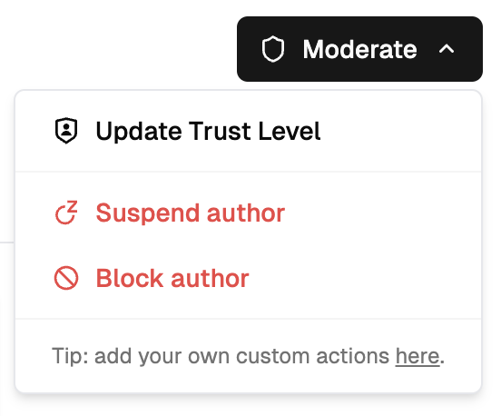

## Overview

Enabling user management in Moderation API solves some of the most common moderation challenges for community platforms.

This is done by introducing the concept of authors (users) in the moderation process. Each author has a [trust level](/users/trust-levels) that is automatically adjusted based on their behavior and moderation history.

User management lets you:

- Tailor and improve moderation accuracy based on trust levels
- Skip moderation for trusted users
- Block or suspend users
- Fraud detection using behavioral analysis

<CardGroup cols={2}>

<Card
  title="User dashboard"
  icon="users"
  href="https://moderationapi.com/app/users"
>
  Access the user dashboard to view and manage your users.
</Card>

<Card
  title="Author API"
  icon="terminal"
  href="/api-reference/author/create-a-new-author"
>
  Access endpoints to read and update author details.
</Card>

</CardGroup>

## Get started

Just add an `authorId` when submitting content to a [moderation
endpoint](/api-reference/moderate/analyze-text).

We recommend using the user ID from your system
but any unique identifier like email or username will work.

You should now see your users appear in the [user dashboard](https://moderationapi.com/app/users).

<Note>
  There might be a delay in user creation and trust level calculation. This is
  because we process users in batches to optimize performance.
</Note>

## Typical workflow

Here's a common workflow for implementing user management in your moderation system:

<Steps>
<Step title="Submit content with author ID">
Start by including an `authorId` when submitting content for moderation:

```javascript
const response = await fetch("/api/v1/moderate/text", {
  method: "POST",
  headers: { Authorization: "Bearer YOUR_API_KEY" },
  body: JSON.stringify({
    content: "User's message content",
    authorId: "user_123",
  }),
});
```

Authors are automatically created on first submission.

</Step>

<Step title="Sync author details">
[Add additional author information](/users/updating-authors) to improve trust scoring and enable fraud detection:

```javascript
await fetch("/api/v1/authors/user_123", {
  method: "PUT",
  headers: { Authorization: "Bearer YOUR_API_KEY" },
  body: JSON.stringify({
    name: "John Doe",
    email: "john@example.com",
    metadata: {
      email_verified: true,
      is_paying_customer: true,
    },
  }),
});
```

</Step>

<Step title="Monitor trust levels">
Check the user dashboard or use the API to monitor [trust levels](/users/trust-levels):

- **New users (Level 0)**: Extra scrutiny for first-time posters
- **Established users (Level 2+)**: Reduced moderation overhead
- **Problematic users (Level -1)**: Automatic flagging for review

</Step>

<Step title="Take moderation actions">

<Frame>
  
</Frame>

When you identify problematic users, take action from the [user dashboard](https://moderationapi.com/app/users):

1. Navigate to the user's detail page
2. Click "Suspend" from the action menu
3. Select duration (e.g., 7 days) and provide reason
4. Confirm the action

The user's status will be updated and your application can respond accordingly.

</Step>

<Step title="Check user status in your app">
Before allowing users to post, check their status and respond appropriately:

```javascript
const author = await fetch(`/api/v1/authors/${userId}`);
const userData = await author.json();

if (userData.status !== "enabled") {
  if (userData.status === "suspended") {
    const suspendedUntil = new Date(userData.block.until);
    throw new Error(
      `Account suspended until ${suspendedUntil.toLocaleDateString()}`
    );
  } else if (userData.status === "blocked") {
    throw new Error("Account has been permanently blocked");
  }
}

// User is enabled - allow posting
await publishContent(content);
```

</Step>

<Step title="Handle webhook notifications">
Set up [webhooks](/review-queues/webhooks) to automatically notify users of moderation actions:

```javascript
// Webhook handler for user actions
app.post("/webhook/user-actions", (req, res) => {
  const { action, userId, reason, duration } = req.body;

  if (action === "AUTHOR_BLOCK_TEMP") {
    // Send warning email to suspended user
    sendEmail(userId, {
      subject: "Account Temporarily Suspended",
      body: `Your account has been suspended. Reason: ${reason}`,
      unsuspendDate: new Date(Date.now() + duration),
    });
  }

  res.status(200).send("OK");
});
```

</Step>
</Steps>
